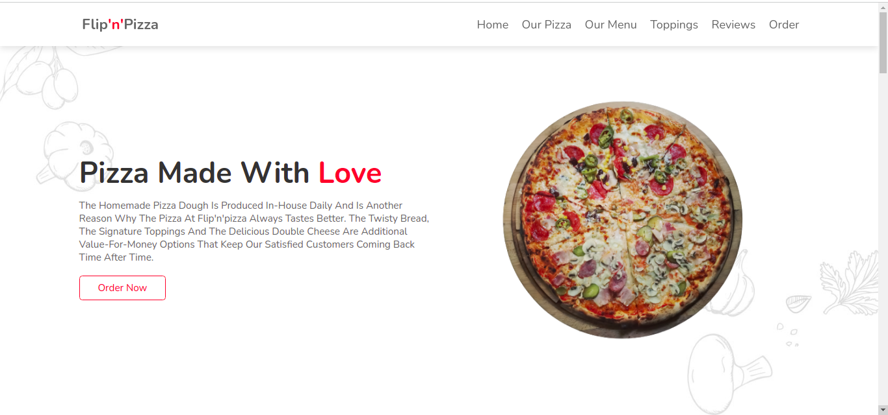

# Flip'N'Pizza

##### By Venesa Atieno 
### Flip'n'pizza's official website.

## Table of Content

  - [Flip'N'Pizza](#flip-n-pizza)
  - [By Venesa Atieno](#by-venesa-atieno)
  - [Flip'n'pizza's official website.](#flip-n-pizza-official-website)
  - [Table of Content](#table-of-content)
  - [Description](#description)
  - [Installation](#installation)
  - [Requirements](#requirements)
  - [Installation Process](#installation-process)
  - [Site Screenshot](#site-screenshot)
  - [Behavior Driven Development](#behavior-driven-development)
  - [Live Link](#live-link)
  - [Technology Used](#technology-used)
  - [Reference](#reference)
  - [Licence](#licence)
  - [Authors Info](#authors-info)

## Description

This web app allows customers to pick from different flavors of pizza from their favorite restaurant, Flip'n'Pizza and with the pizza constructor feature they can customize their pizza by adding toppings according to their taste, and place an order

## Installation

### Requirements

* Either a computer,phone,tablet or an Ipad

* browser

* An access to the Internet

### Installation Process

[Go Back to the top](#flip-n-pizza)

## Site Screenshot

Here's an image of the design of the site :

Landing page:

## Behavior Driven Development

Specification: Flip'n'Pizza

When name and email and message are inputted in a form 
Then an alert is sent out to confirm receipt of message.

When an input space is blank
Then an alert message is sent to the user to fill the form.

When an checkout button is clicked
Then an alert message of summary of order and cost is sent to the user.

## Live Link

here is the link to the site https://venesaokuna.github.io/flip-n-pizza/

## Technology Used

* HTML - which was used to build the structure of the pages.

* CSS - which was used to style the page.
  

* JavaScript - which was used to add some functionality.
  
* JQuery - which was used to add some functionality.

## Reference
* Materialize CSS
  
* W3Schools

* Youtube  

[Go Back to the top](#flip-n-pizza)

## Licence

MIT License

Copyright (c) [2021] [Venesa Atieno]

Permission is hereby granted, free of charge, to any person obtaining a copy
of this software and associated documentation files (the "Software"), to deal
in the Software without restriction, including without limitation the rights
to use, copy, modify, merge, publish, distribute, sublicense, but not to sell
copies of the Software, and to permit persons to whom the Software is
furnished to do so, subject to the following conditions:

The above copyright notice and this permission notice shall be included in all
copies or substantial portions of the Software.

THE SOFTWARE IS PROVIDED "AS IS", WITHOUT WARRANTY OF ANY KIND, EXPRESS OR
IMPLIED, INCLUDING BUT NOT LIMITED TO THE WARRANTIES OF MERCHANTABILITY,
FITNESS FOR A PARTICULAR PURPOSE AND NONINFRINGEMENT. IN NO EVENT SHALL THE
AUTHORS OR COPYRIGHT HOLDERS BE LIABLE FOR ANY CLAIM, DAMAGES OR OTHER
LIABILITY, WHETHER IN AN ACTION OF CONTRACT, TORT OR OTHERWISE, ARISING FROM,
OUT OF OR IN CONNECTION WITH THE SOFTWARE OR THE USE OR OTHER DEALINGS IN THE
SOFTWARE.

[Go Back to the top](#flip-n-pizza)

## Authors Info

I am self-driven and passionate about Software development and all types of art, especially camera works. I take each day as a learning opportunity and seek to develop new skills .

Linked - [Venesa Atieno](www.linkedin.com/in/venesa-atieno)

Github - [Venesa Atieno](https://github.com/VenesaOkuna)

Behance - [Venesa Atieno](https://www.behance.net/venesaatieno)

[Go Back to the top](#flip-n-pizza)
